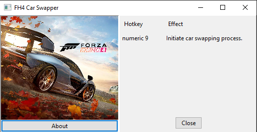

# Forza Horizon 4 Car Swapper
Forza Horizon 4 Car Swapper is a Cheat Engine Trainer that allows you to buy any car at FH4.

## Preview

 
Click to view image

 

## How to use
### IMPORTANT: You need to have Cheat Engine installed for the trainer to work. Download it [**here**](https://www.cheatengine.org).
On Forza Horizon 4, go to the Autoshow and hover over the 124 Spider by Abarth (check if there is a pink ring around the 124 Spider). Launch the trainer and press num 9. Then input the ID of the car you want. The table with the IDs is [here](https://airtable.com/shr7Qyl9DhImLqGkt/tbltPCua61toz0Qay/viw7I8xAKXcCwdSLX). Then just press enter and let the trainer do its thing. After 20-60 seconds, a message will appear on your screen saying that the vehicle was swapped. Head back to FH4 and select the 124 Spider. Now, you will be able to see that the 124 has changed into the vehicle you wanted. Just buy it. **Tip:** Play in the lowest graphic settings possible!

## Credits
### Draff, from the [Forza Mods](https://discord.gg/RefdFEA) Discord server for the LUA script
### Konman for the IDs list
### visible for the generated trainer 

## Download 
Download it [**here**](https://github.com/manovisible/fh4carswapper/releases).
